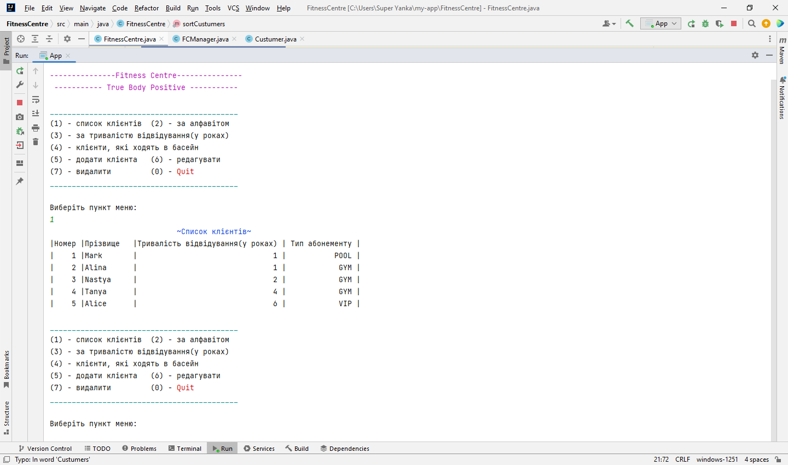
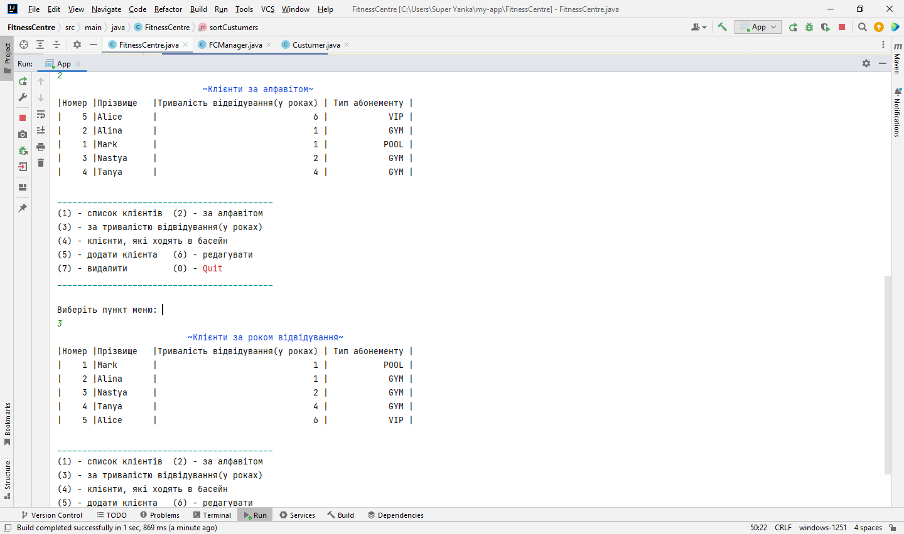
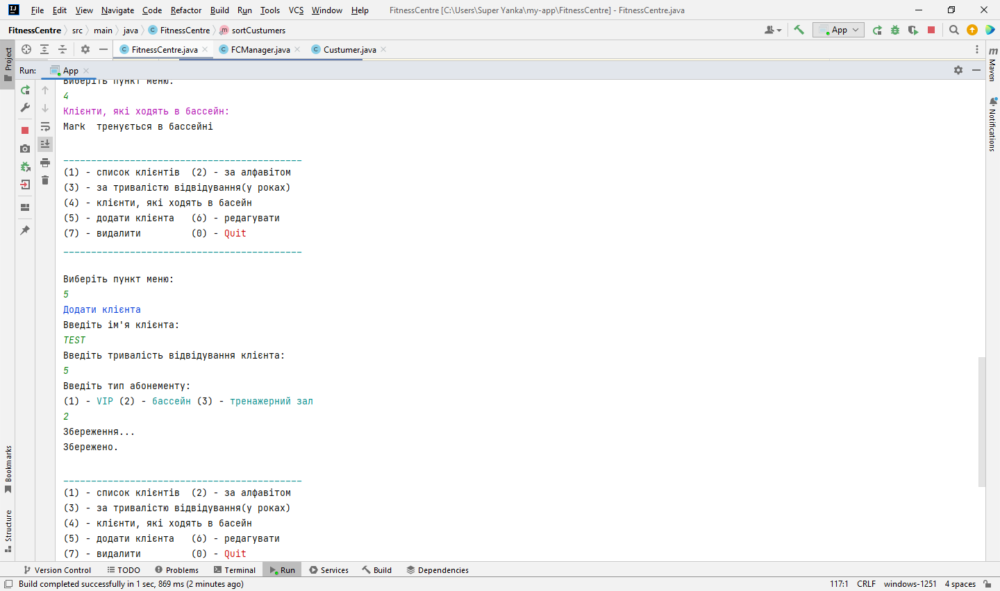

# Fitness Centre Management System

Educational Java console application created during the **Programming-2: Object-Oriented Programming** course in spring 2022.

The project simulates a simple information system for a fitness centre and provides basic client management features.

## Features

- Add new clients
- Edit client information
- Delete clients
- Sort clients by name
- Sort clients by training duration
- Search clients by subscription type
- Work with collections and comparators
- Console-based menu interaction

## Technologies

- Java
- Object-Oriented Programming
- Collections
- Comparator
- IntelliJ IDEA

## Project Structure

The project includes several main components:

- `Custumer` — stores client information
- `FitnessCentre` — manages the client list
- `FCManager` — provides console menu interaction
- `Type` — defines subscription types: VIP, POOL, GYM
- Comparator classes — sort clients by name, ID and training duration

## What I Learned

- Basic principles of OOP in Java
- Working with classes and enums
- Creating a console menu
- Managing collections
- Sorting objects using Comparator
- Implementing basic CRUD logic

## Screenshots

### Console menu

### Clients list

### Operations

## Status

Educational archived project.  
Created as part of university coursework.
